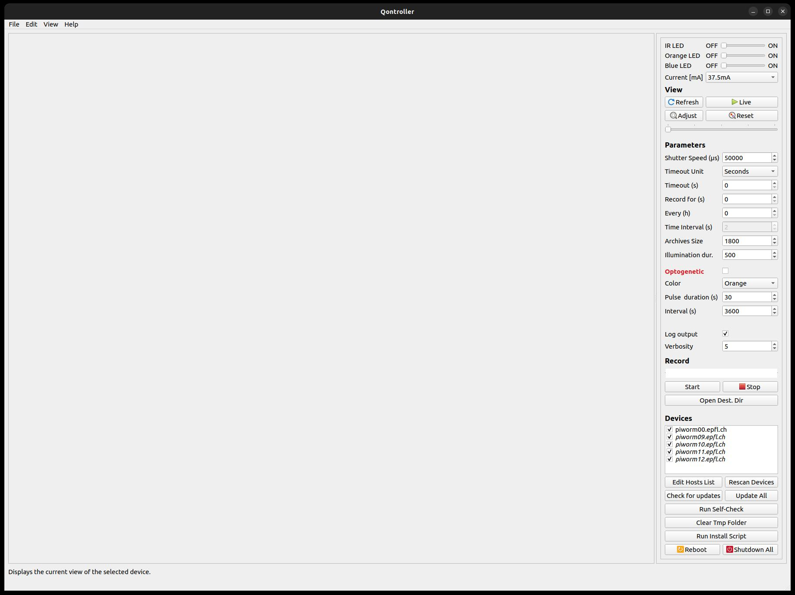
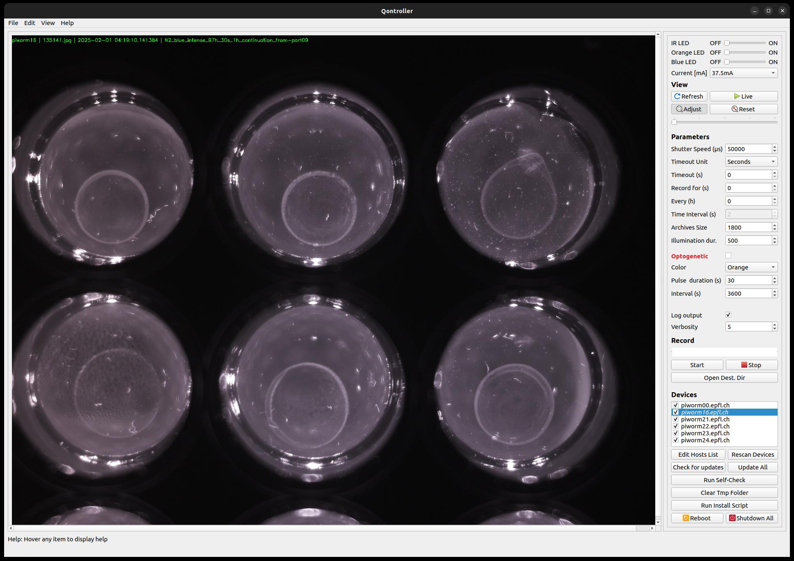
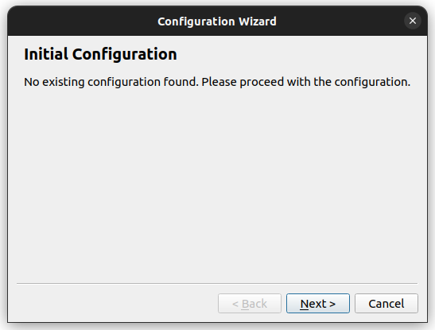
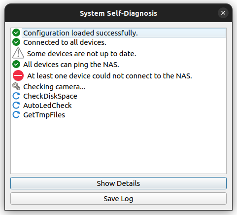

# WormStation Controller

A user-friendly GUI for high-throughput **_C. elegans_** imaging and optogenetic stimulation. This application streamlines camera control, LED management, and data logging for multiple Raspberry Pi–based recording stations connected to the same network (or VPN).

---

## Features

- **Multi-Platform GUI**  
  Runs on Windows, Linux, or macOS, enabling you to control multiple WormStation devices from a single interface.  
- **Centralized Device Management**  
  Automatically discovers Raspberry Pi hosts running WormStation services; add or remove them via a simple hosts file.  
- **Live/Preview Modes**  
  Fetch single frames to verify plate alignment or enable “Live” mode for near-real-time updates.  
- **Optogenetic/Visible Light Control**  
  Configure orange or blue LEDs for experiments requiring red-shifted channelrhodopsins or aversive stimuli.  
- **IR Illumination**  
  Use IR LEDs for dark-field imaging without disturbing worm behavior.  
- **Recording Schedules**  
  Define how long each recording session runs, how often it repeats, and control strobing or continuous illumination.  
- **Built-in Self-Check**  
  Diagnoses hardware connectivity, disk space, and network availability to ensure reliable long-term operation.  
- **Modular Logging**  
  Adjustable verbosity, automated local storage, and optional upload to a Network Attached Storage (NAS) for centralized data management.

---

## Screenshots

Below are some representative images of the WormStation Controller GUI:

1. **Initial Blank Interface**  
     
   The interface upon startup, before selecting any device.

2. **Main GUI with Connected Device**  
     
   Shows a device in preview mode, including LED toggles, recording parameters, and console output.

3. **Configuration Wizard**  
     
   A step-by-step setup guide for first-time users, helping configure paths, hosts, and default parameters.

4. **Self-Check Diagnostics**  
     
   A quick test to confirm camera and LED connectivity, disk space availability, and NAS access.

---

## Installation

### Prerequisites

- **Python 3.9 or later**  
- Recommended: a dedicated Python virtual environment (venv or conda)

### Steps

1. **Clone the repository**:
   ```bash
   git clone https://github.com/mmaatthieuu/wormstation_controller.git
   cd wormstation_controller

2. **_(Optional)_ Use a dedicated environment:**
   - Using `conda`:  
      ```bash
      conda create --name wormstation python=3.9
      conda activate wormstation
      ```
   
   - Using `venv`:
      ```bash
      python -m venv wormstation
      source wormstation/bin/activate # Linux/macOS
     
      wormstation\Scripts\activate.bat # Windows
      ```

3. **Install dependencies:**
   ```
   pip install -r requirements.txt
   ```
4. **Run the program:**
   ```
   python gui_launcher.py
   ```


---

## Usage Overview

1. **Start the GUI**  
   - Run `python3 gui_launcher.py`.  
   - If this is your first time launching the WormStation Controller, an initialization wizard will guide you through configuring host addresses, default paths, and basic settings.  

2. **Edit Hosts List**  
   - If the host list is empty, or you wish to add new devices, click the **Edit Hosts List** button in the GUI.  
   - Populate the list with the network addresses or DNS aliases of each Raspberry Pi running a WormStation.  
   - Use `#` to comment out any devices you want the GUI to ignore.

3. **Select a Device**  
   - In the “Devices” panel, choose a Raspberry Pi host and click **Refresh** to fetch a single frame or check **Live** for continuous frame acquisition.  
   - Note: “Live” mode fetches frames sequentially and can be slow or CPU-intensive if used for a long time.

4. **Configure LEDs**  
   - Toggle IR, orange, or blue LEDs to test or preview illumination.  
   - In preview mode, the drop-down menu controls LED current, but actual recordings will override this to ensure optimal brightness.

5. **Set Recording Parameters**  
   - **Shutter Speed** balances brightness and motion blur; higher values yield brighter but potentially blurrier frames.  
   - **timeout** or **Record for (s) / Every (h)** define the total experiment duration or how often recordings should occur.  
   - **Archives Size** segments extended recordings into separate video files.

6. **Optogenetic Stimulation**  
   - Check **Optogenetic** to enable orange or blue LED pulses.  
   - **Pulse Duration (s)** determines how long pulses run in total (split internally into 1-second on/off cycles),  
     while **Interval (s)** defines the gap between stimulation blocks.

7. **Logging & Verbosity**  
   - Select a verbosity level from 0 (none) up to 7 (very verbose).  
   - Logs are stored locally at `~/log/...` on each Pi, then periodically uploaded to the NAS for unified storage.

8. **Start and Stop**  
   - Check the devices you want to record, then press **Start**. **Stop** fully terminates the recording session.  
   - **Open Dest. Dir** shows the folder containing recorded frames or compressed video segments.

9. **Self-Check**  
   - **Run Self-Check** verifies camera connectivity, LED drivers, disk space, and NAS availability.  
   - Recommended before launching long experiments to catch potential issues early.

10. **Additional Tools**  
    - **Update All** pulls the latest WormStation client from the GitHub main branch for each Pi.  
    - **Run Install Script** applies the software installation process to newly added devices.  
    - **Reboot** and **Shutdown** affect all listed devices—use with caution if ongoing experiments are running.


Example:
```
python3 gui_launcher.py
```


---

## License

This project is licensed under the [MIT LICENSE](LICENSE). 
Feel free to customize and integrate it into your own laboratory workflows.

---

## Acknowledgments

